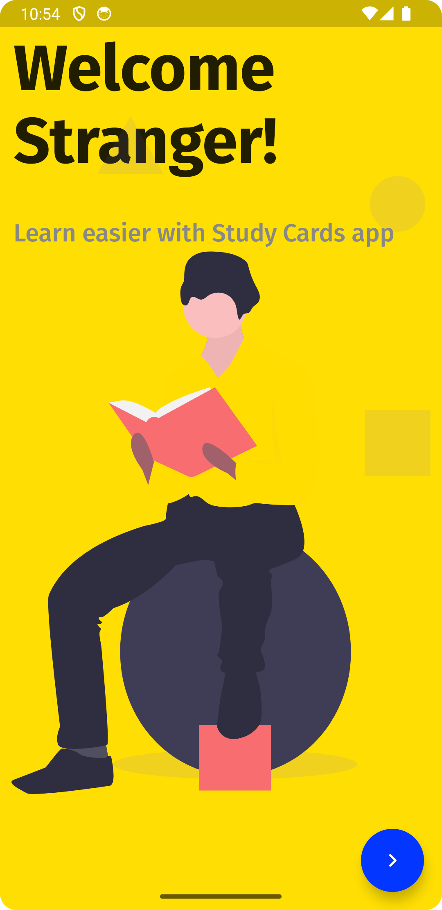
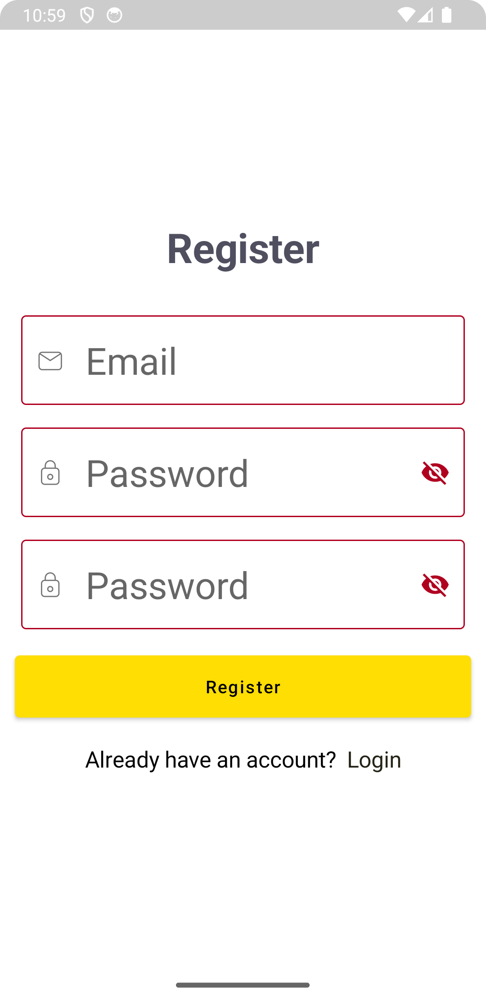
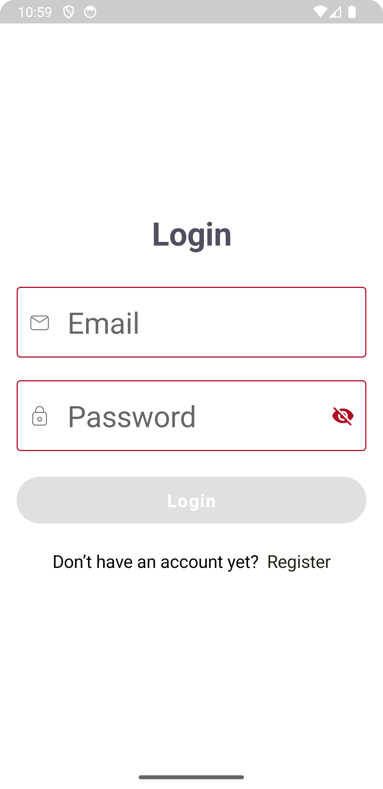
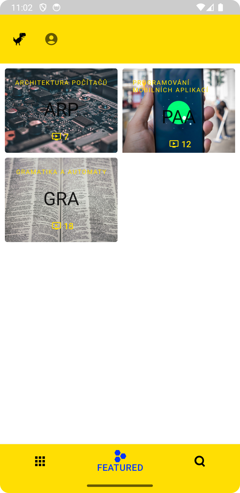
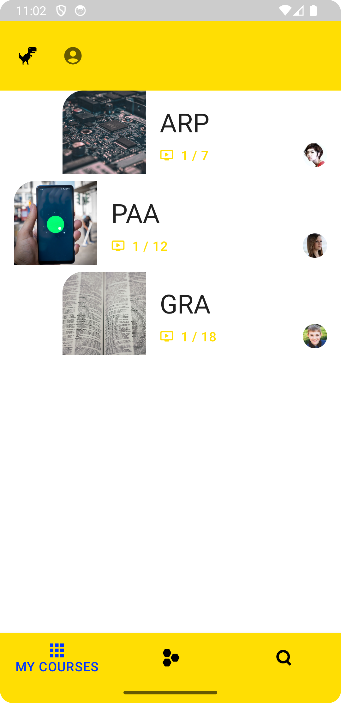

# StudyCards
## Jetpack Compose Android App
- Android Jetpack Compose project based on my personal project Learning Cards. Done as a school project.
- App Helps you to learn more efficiently by having quick access to all courses.

# Features
- [x] Login/Register using Firebase
- [x] MaterialDesign *DarkMode not ready*
- [x] UnsplashAPI
- [x] RemeberState of App
# Features

- [x] **Multi-language Support:** Explore learning cards in multiple **languages** (CZ,ENG).
- [x] **Interactive UI:** Navigation is implemented with **composable** and NavHostController.
- [ ] **MaterialDesign** The app mostly uses MaterialTheme for Icons and colors. *Dark mode not yet done*
- [x] **User Authentication:** Securely log in and Registration with **FIREBASE**.
- [x] **Dynamic Data Handling:** Fetch images from **UnsplashAPI**.
- [ ] **RemeberState of App** The App should remember where you left of. 

# Screenshots

### welcomeScreen

### registerScreen

### loginScreen

### mainFeaturedCourses

### coursesScreen

## Future Implementation

- [] **User Profiles:** Access user profile with additional details.
- [] **Logout:** Add Logout User functionality to the Top App Bar.
- [] **Community Features:** Interact with other students through comments and discussions.
- [] **Secret Protection:** Using GitGuardion implement a protection to keep secret credentions from leaking.

# References

### Assets

- The Vector images are not from me. @author: [abdulazizahwan](https://github.com/abdulazizahwan/MyLearningApp.git)
- Code that was obtained from external repository or documentation is marked as ``//NENI MOJE TVORBA``

### Documentation

- [Firebase](https://firebase.google.com/docs/auth/android/start)
- [Unsplash](https://unsplash.com/documentation)
- [GitGuardian](https://www.gitguardian.com)
  
# License

- This project is licensed under the [BSD-2-Clause License](LICENSE).
